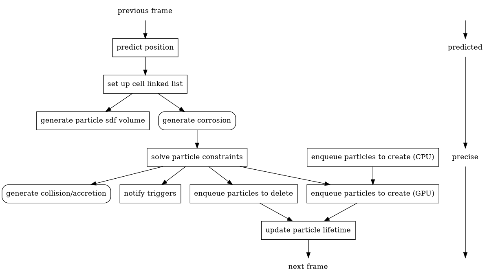

[TOC]

# Physics (Under Development)
## 1 Overview

GraphViz is required to render the graph above

note that:
- particle sdf volume for rendering are generated with predicted positions. in this way, the cll is reused though accuracy is compromised
- corrosion is imposed before solving constraints to be more "corrosive"

## 2 Interaction of Particles
there are three types of interaction:
- collision only reads sdf
- corrosion and accretion update sdfs, considering that there may be other modification, they are aggregated and processed later

the buffer that stores these requests are called modification buffer, whose elements are composed as follows:
```c++
struct
{
    uint16_t Source;
    uint16_t Type;
    float Args[7];
}
```

`Source` indicates the source of modification, other fields function same as their names

## 3 CRUD of Particles
Particles are stored compactly within one buffer, see `FluidProcess.cginc` for detailed layout.

### 3.1 Read/Update
These two operations can be done by directly indexing into the buffer.

### 3.2 Create/Delete
Since CPU might want to directly create/delete particles, these particles are transferred to a buffer to which afterwards GPU issues requests. Actual create/delete are fully handled by GPU and processed within one kernel:
1. Newly created particles simply overwrite particles that is to be removed.
2. If created particles are more than removed particles, exceeding part is simply appended to the particle buffer.
3. If removed particles are more than created particles, *stream compaction* is needed, which maintains the compactness of buffer. It is carried out in subsequent dispatches.

#### 3.2.1 Instable Stream Compaction
If `m` particles are deleted and `n` particles are created, then at most `max(0, m - n)` empty slots are left. These slots can be filled by moving endmost particles. The amount is denoted as `k` in remainder of this section.

Note that the compacted capacity `c'` can be calculated regardless of actual compaction. Thus the amount of `k` can be reduced by counting slots whose indices are less than `c'`.

It's obvious that `k` particles can be found by accessing at most `min(2k, c)` endmost elements, where `c` is the capacity before compaction. Note that finding `k` endmost alive particles is equivalent to compacting them stably.

The implementation is inspired by [^DVJC]. The original algorithm reduces bandwidth but undergoes three stages, which is tedious and tends to impact performance. The implementation rather refers to the single-pass prefix scan algorithm[^DM].

[^DVJC]: Darius Bakunas-Milanowski, Vernon Rego, Janche Sang, Chansu Yu: Efficient Algorithms for Stream Compaction on GPUs.
[^DM]: Duane Merrill, Michael Garland: Single-pass Parallel Prefix Scan with Decoupled Look-back.

Main process of the implementation (*italic* words are glossary used in [^DM]):
1. **Group** claims a *partition* by atomic operations.
2. **Threads** count alive particles within each *partition*, the amount is named *aggregate*.
3. **Group** updates the *status* to *A*.
4. **Threads** perform prefix scan over the *partition*.
4. **Threads** look back to predecessor and calculate *exclusive prefix sum*. No deadlock will occur since the step 1 guarantees that *partitions* are claimed incrementally.
5. **Group** adds up the *aggregate* and *exclusive prefix sum* to yield *inclusive prefix sum* and updates the *status* to *P*.
6. **Threads** add the exclusive prefix sum to every element within the *partition*.

Because of the few possible status, status is not recorded as an individual field. Only *aggregate* and *inclusive prefix sum* is present in *partition descriptor*.
