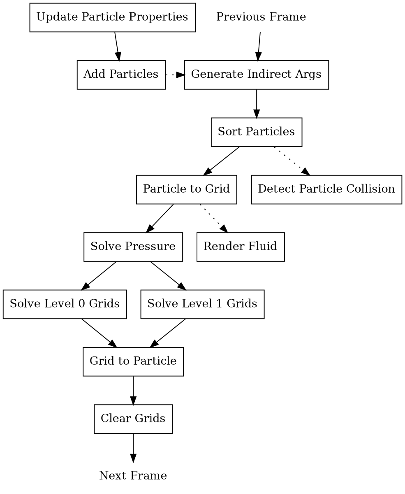

# Physics (Under Development)
## 1 Overview
The physics simulation module adopts the idea of material point method, a hybrid eulerian-lagrangian method. Read `FluidSolver.compute` for detailed references.

Illustration of one physics frame:

*GraphViz is required to render the graph above*

For better understanding, it's recommended to read the source code. Since docs might fall behind the source code.

## 2 Memory Footprints
### 2.1 Global Memory
Most of the textures and buffers that involve in simulation are defined in `FluidSolver.compute` and `FluidData.cginc`. You can search "extern" to find these definitions.

Before continuing, some of important optimizations must be explained:
1. As pointed out by [Gao et al.](https://doi.org/10.1145/3272127.3275044), it's more optimal to store particles' position in a standalone buffer, seperated from other quantities.
2. Not all lagrangian grids are finest. Similar to [SPGrid](https://pages.cs.wisc.edu/~sifakis/project_pages/SPGrid.html), multi-resolution scheme is opted.

### 2.2 Group Shared Memory
Group shared memories are postfixed by `_GSM`.

## 3 CRUD of Particles
To better parallelize simulation, Particles are stored compactly within one buffer, see `FluidProcess.cginc` for detailed layout.

### 3.1 Read/Update
These two operations can be done by directly indexing into the buffer.

### 3.2 Create/Delete
Since CPU might want to directly create/delete particles, these particles are transferred to a buffer to which afterwards GPU issues requests. Actual create/delete are fully handled by GPU and processed within one kernel:
1. Newly created particles simply overwrite particles that is to be removed.
2. If created particles are more than removed particles, exceeding part is simply appended to the particle buffer.
3. If removed particles are more than created particles, *stream compaction* is needed, which maintains the compactness of buffer. It is carried out in subsequent dispatches.
